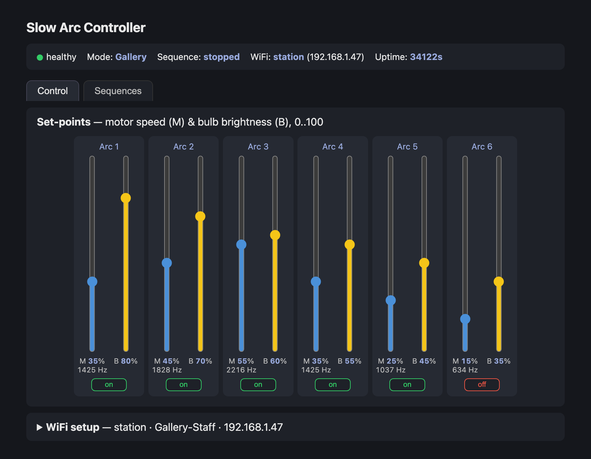
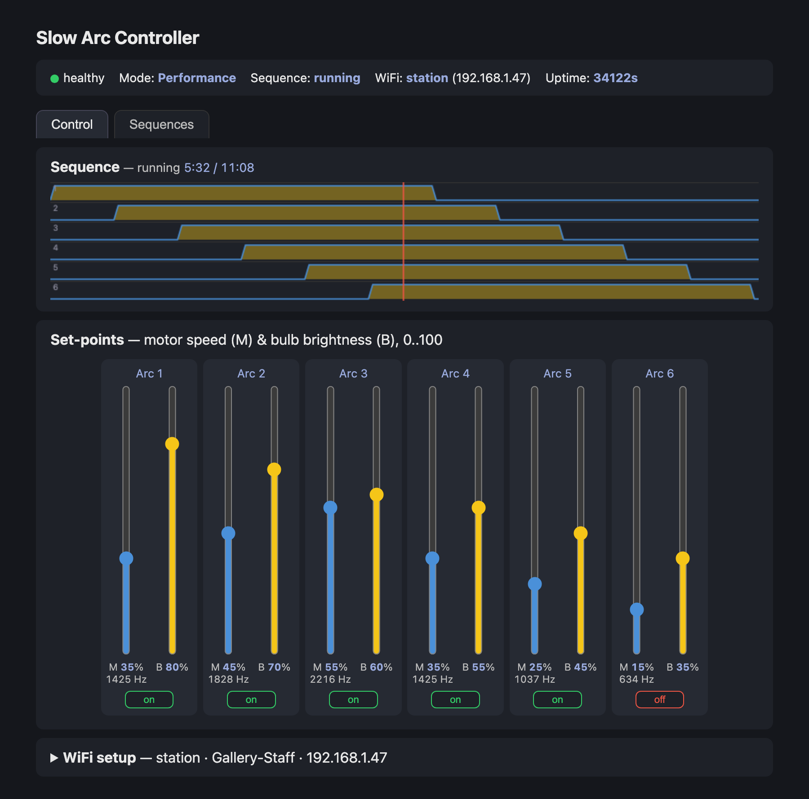
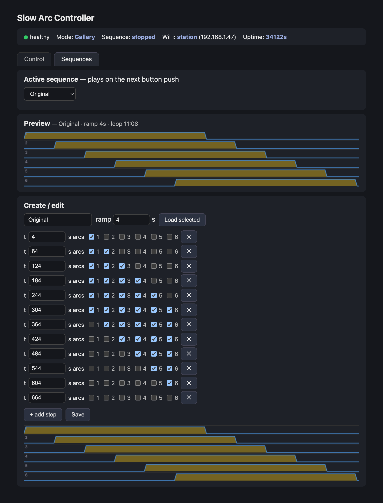
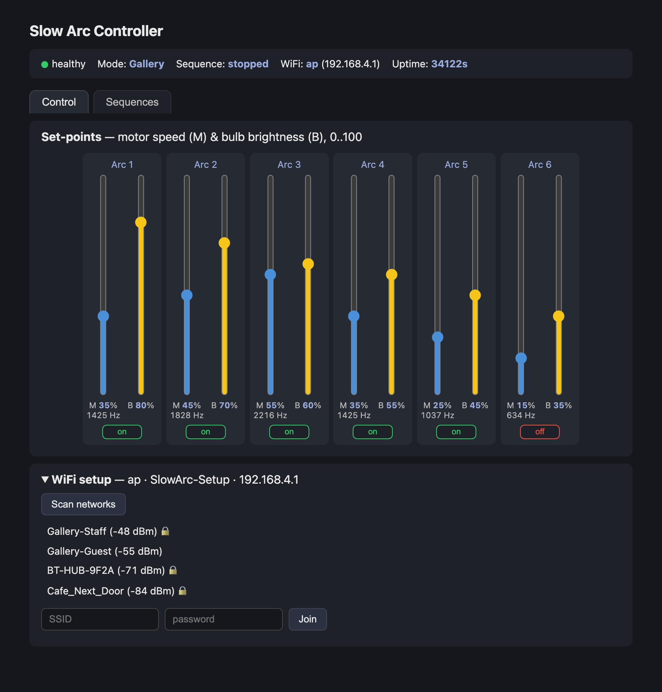
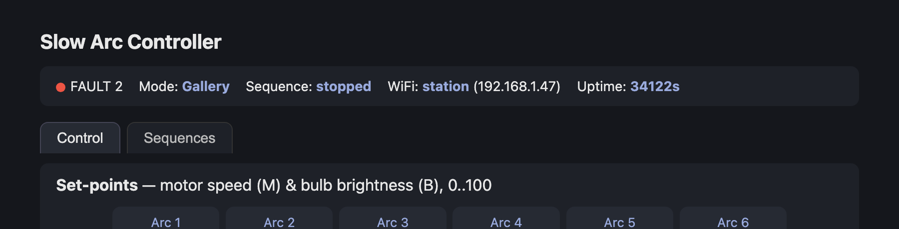

# Slow Arc — User Guide

For anyone running the installation day to day. No technical knowledge needed.

The controller is a small box that runs **six Slow Arcs**. Each arc has a pair of bulbs
that fade up and down, and a motor that turns it slowly. The box remembers everything
you set, and keeps running on its own whether or not there is WiFi.

---

## 1. The box

> **[ photo placeholder ]** — `docs/img/front-panel.jpg`
> The front panel: the mode switch, the sequence button, and the status light.

> **[ photo placeholder ]** — `docs/img/box-installed.jpg`
> The box in place, showing where the arcs connect.

There are only three things on the outside:

| | What it does |
|---|---|
| **Mode switch** | Chooses Gallery or Performance (see below). The web page can do the same; whichever was used most recently is in charge. |
| **Sequence button** | In Performance mode, starts and stops the choreography. Does nothing in Gallery mode. The web page's Play / Stop button does the same. |
| **Status light** | A small coloured light telling you the box is healthy. See §5. |

---

## 2. Turning it on

Switch on the power. Then:

1. The status light comes on **solid amber** for a few seconds.
2. The bulbs fade up gently — never all at once, and never instantly. A slow, staggered
   rise is normal and deliberate; it protects the bulbs and the power supply.
3. The motors start turning.
4. The light settles into a **slow green pulse**. The box is running normally.

Everything comes back exactly as you left it. Brightness, speed, mode, and your
sequences are all remembered through a power cut — including a mode chosen on the web
page, whatever the switch says. A sequence that was playing does **not** restart by
itself: the box comes back in Performance, waiting, until someone presses Play or the
sequence button.

**One exception:** if you switched any arcs off from the web page, they come back **on**
after a power cycle. That is intentional — a box restarting overnight shouldn't come
back with an arc dark that nobody notices.

---

## 3. The two modes

Set with the physical switch on the box **or** the Gallery / Performance buttons at the
top of the web page's Control tab. Whichever was used last is in charge, so a box mounted
out of reach can be run entirely from the page (§6).

**Gallery** — each arc simply holds its own settings. Arc 1 stays at its brightness and
speed, arc 2 at its own, and so on, indefinitely. This is the normal day-to-day mode.

**Performance** — the box plays a **sequence**: a timed piece where arcs fade in and out
in a set order. The status light turns blue and blinks the moment the mode changes,
which is your confirmation it has taken. Press the sequence button (or **Play** on the
page) to start the piece; press again (or **Stop**) to stop. Play on the page also
switches to Performance if the box was in Gallery.

When you stop a sequence, the arcs **hold wherever they are** rather than jumping back.
Switch to Gallery to return them to their normal settings.

**When the page overrides the switch.** If the page sets a mode different from where the
switch sits, the page wins until the switch is next flipped. The switch then no longer
shows the box's real mode, so the status light adds a **brief white blip every two
seconds** on top of its normal pattern, and the page outlines the front-panel box in red
with **overridden by this page** across it.
Either flip the switch (twice, if it has to end up where it already is) or choose the mode
on the page that matches the switch, and the blip stops.

---

## 4. Getting to the control page

The box hosts its own web page. You reach it from a phone, tablet, or laptop.

**If the box is on the gallery WiFi** — connect your device to the same network and go to
`http://slow-arc.local`. That name follows the box around, so you never need to know or
write down the number the router gave it. It works on Macs, iPhones, iPads, and current
Windows; on anything that can't resolve it, use the numeric address shown on the box's
status line instead, e.g. `http://192.168.1.47`.

The status line prints both, and the `slow-arc.local` line is a link — so once you're on
the page from any route, that's where to find the address again.

**If the box is not on any network** (a new box, or the WiFi is down) — it makes its own
network:

- **Network name:** `SlowArc-Setup`
- **Password:** `slowarc123`

Join that from your phone and the control page should open by itself. If it doesn't, go
to `http://192.168.4.1`.

This always works, even with no internet in the building, so you can always reach the box
on site.

---

## 5. The status light

| Light | Meaning |
|---|---|
| Solid amber | Starting up. Normal for the first few seconds. |
| Slow green pulse | Healthy, in Gallery mode. |
| **Blue blinking** | Healthy, in Performance mode, waiting. Press the sequence button. |
| Slow blue pulse | Healthy, sequence playing. |
| Amber pulsing | Looking for WiFi. Harmless — the arcs run regardless. |
| Fast blue flicker | A software update is being installed. Do not cut the power. |
| **Red flashes** | A fault. **Count the flashes** — see below. |
| White blip every 2 s, on top of any of the above | The web page has overridden the mode switch — the switch isn't showing the real mode. See §3. |

The light turns blue the instant the box goes into Performance, so you can
confirm the change has taken without waiting to see what the arcs do. It blinks
on and off while waiting and settles into a smooth breathing pulse once a
sequence is playing. (The blue flicker of a software update never goes fully
dark — that is how you tell the two apart, and updates only happen when someone
is deliberately installing one.)

Red flashes repeat in groups with a pause between:

- **2 flashes** — a bulb problem. One or more arcs may not light.
- **3 flashes** — a motor problem. One or more arcs may not turn.
- **4 flashes** — a power problem. Usually means the supply dipped when the bulbs came on.

Count the flashes and pass the number to whoever maintains the box — it tells them where
to look. A single red pattern that clears itself after a minute or so following a restart
is worth mentioning but not urgent.

---

## 6. The Control tab

The top strip is the box's status at a glance: healthy or faulty, which mode, which
sequence is selected and whether it is running, which WiFi network it is on, and how long
it has been on. If the box is still serving its own **SlowArc-Setup** network, an amber
line asks you to connect it to a local WiFi network, with a link to **WiFi setup**.

Under the tabs, the **Override physical controls** card has two halves. On the left,
**This page** does the job of the front panel: **Gallery** and **Performance** choose the
mode, and **▶ Play / ■ Stop** starts and stops the selected sequence. The highlighted
button is the box's current mode. On the right, **Front panel** shows the controls on the
box itself: which way the mode switch is set, and when the sequence button was last
pushed. If the page has overridden the switch, that half is outlined in red and marked
**overridden by this page** (§3).

If the strip turns red and says **OFFLINE**, the page has lost contact with the box —
it has been powered down, or your phone has left the network. The sliders below grey
out and stop responding, because what they are showing is the last reading received
rather than anything current. The strip counts up how long it has been out of contact,
and comes back by itself within a few seconds of the box returning.

Below it, one column per arc. **Note that these values should not be adjusted except on 
explicit instructions from Conrad or his team.**

- The **blue slider (M)** is motor speed, 0–100.
- The **yellow slider (B)** is bulb brightness, 0–100.
- The **box under the two sliders** is the motor's speed in Hz — the actual step rate,
  60 to 8000. It is the real setting; the M slider is just a quick way to move it. Type a
  number and press Enter (or tap away) to set a speed exactly, e.g. to give two arcs the
  same rate or to return to a number written down at commissioning.
- The **on / off button** switches that arc off completely — dark and stopped — without
  losing its settings. Useful if a bulb blows or an arc needs attention mid-show. Press
  again to bring it back exactly as it was.

Changes take effect as you drag or as you leave the Hz box, and save themselves a second
or two later. There is no save button and nothing to confirm.

Set 0 to turn that half off: brightness 0 is dark, speed 0 is stopped. A typed speed
between 1 and 59 Hz is raised to 60 — below that the motor is switched off instead, so
there is no crawling-but-not-quite-stopped state.

---

## 7. Watching a sequence play

In Performance mode a timeline appears above the sliders.

Each of the six rows is one arc. The yellow shape shows when that arc is lit; the red
line is the current position, sweeping left to right and looping. The header names the
piece being drawn and shows how far through you are — `5:32 / 11:08` above.

If you pick a different sequence while one is playing, the header says so —
*"FAST" starts on the next press* (of Play or the sequence button). The drawing keeps showing the piece that is
actually playing until you stop and start it again. Nothing has been lost; the box
is just refusing to cut a piece off part-way through.

Note that the sequence controls **when** each arc rises and falls, not how bright or fast
it goes. That still comes from the sliders. So you can re-tune the look of the piece at
any time without touching the choreography.

---

## 8. The Sequences tab

Three sections.

**Active sequence** — pick which piece plays. If a sequence is playing when you change
this, the new one starts at the **next** press of Play or the sequence button, so you never cut a
piece off mid-way. The line under the menu tells you which of the two happened, and the
Control tab names the selected piece in its status strip.

**Preview** — the same timeline view, for the sequence you selected, so you can see its
shape before committing to it. The header gives its ramp and total length.

**Create / edit** — build a piece of your own:

1. Give it a **name**. Saving with the name of an existing sequence replaces that one, so
   use a new name if you want to keep both.
2. Add **steps**. A step is a moment in time, a set of arcs and a ramp: *"at 4 minutes,
   arcs 1, 2 and 3 are on, fading in over 2 seconds."* Times are in seconds, to a tenth
   of a second (`240` or `240.5`); the `m:ss.s` beside each time shows the same moment in
   minutes. Tick the arcs that should be lit at that moment.
3. Set each step's **ramp** — how long the fade into that step takes. The fade *finishes*
   at the step's time, so a step at 240 s with a 2 s ramp starts changing at 238 s. A ramp
   of `0` switches instantly. New steps take the **new-step ramp** from the box above.
4. Set the **loop** length — where the piece starts over. Leave it blank and it loops at
   the last step plus that step's ramp.
5. **Save**. The drawing at the bottom updates as you work, so you can see the shape
   before saving.

The piece loops. It starts in the state of its last step, so the join is seamless.

To modify an existing piece rather than start blank, select it above and press **Load
selected**.

The line beside the Import / Export buttons shows the step count and the **loop length**.
When a music track is loaded (§9) it shows the track's length too, so you can make the two
match exactly.

The box holds up to **8 sequences**, each up to **1000 steps**. Long lists scroll inside
the card; more rows appear as you scroll down.

### Writing a sequence in a spreadsheet

A long piece — one that follows a 40-minute track, say — is far easier to write in a
spreadsheet than one step at a time. Lay it out like this and save it as CSV:

| time | arc1 | arc2 | arc3 | arc4 | arc5 | arc6 | ramp |
|---|---|---|---|---|---|---|---|
| 4 | 1 | 0 | 0 | 0 | 0 | 0 | 4 |
| 64 | 1 | 1 | 0 | 0 | 0 | 0 | 0.5 |
| 2:04.5 | x | x | x | | | | 2 |
| 2400 | END | | | | | | |

- **time** is seconds (`64`, `64.5`, `2,392.0`) or minutes and seconds (`1:04.5`), to a
  tenth of a second.
- For each arc, **1**, **x** or **on** means lit; **0**, **off** or an empty cell means dark.
- **ramp** is the fade into that row's state, in seconds (0–600). A blank ramp cell takes
  the editor's new-step ramp.
- Keep the header row: it's how the importer knows which column is the ramp.
- An optional last row with **END** sets where the loop closes — for a 40-minute track
  put END at `2400`. Without it, the loop closes at the last step plus its ramp.
- Instead of six arc columns you can use a single column of numbers 0–63 (header
  `time,mask,ramp`), where arc 1 counts 1, arc 2 counts 2, arc 3 counts 4, and so on.
- A file in the older layout, with no ramp column, still imports: every step then gets
  the ramp between the last step and END, which is what that layout meant.

Press **Import CSV…** and choose the file. It fills the editor and the drawing, but
nothing is sent to the box until you press **Save**. If any row has a problem, nothing is
loaded and the lines are listed by number, so you can fix them in the spreadsheet.

**Export CSV** does the reverse: it downloads what's in the editor in the same layout,
ready to open in a spreadsheet and import again.

The built-in sequence, **"Original"**, is the piece the arcs wake one at a time over about
five minutes, all six hold together, then they fall away in the same order — an eleven
minute loop.

---

## 9. Playing the music with the lights

The Control tab's **Audio** card plays a music track from the laptop in step with the
sequence, through the laptop's own sound output (and on to the speakers). The track stays
on the laptop; it is never sent to the box.

1. On the laptop that feeds the speakers, open the control page and tick **Play audio on
   this browser**. Phones used only as remotes leave this unticked and stay silent.
2. Press **Choose track…** and pick the music file. The browser keeps a copy, so after a
   reload or a restart you don't have to pick it again — as long as you open the page at
   the same address.
3. **Click anywhere on the page** when the yellow banner asks. Browsers won't play sound
   until someone has clicked on the page, so this is needed once each time the page is
   opened.

From then on the music follows the lights, however the sequence is started — the Play
button on this page, the front-panel button, or another phone. It starts at the same
point in the piece as the arcs and fades out when the sequence stops or the box goes to
Gallery. Once playing, the music is never adjusted — any jump in it would be heard.

With **Keep the lights in step with the audio** ticked (the default), the page instead
nudges the *sequence* a few milliseconds at a time to stay with the music; nobody can see
the arcs move 20 ms early or late. Unticked, music and lights simply run side by side from
a common start. The status line shows how closely they agree, e.g.
`playing (+8 ms) · lights follow the audio`. Tick it on one browser only: two laptops
following two copies of the track would pull the sequence between them.

- **Match the lengths.** The sequence's loop length should equal the track's length — a
  40:00 track needs a sequence that closes at 2400 s (see the END row in §8). The card
  warns when they differ.
- **If the sound is early or late** compared with the arcs, adjust **offset**: a positive
  number plays the sound earlier. Bluetooth speakers need several hundred ms; a cable or
  USB sound interface needs little or none.
- **Use a compressed copy of the track** such as a 256 kbps AAC `.m4a`. It sounds the
  same as the master and works in every browser. For no loss at all, a FLAC copy is
  about 40% smaller than the WAV; Chrome and Edge also accept the full-size WAV.
- **Keep the page open and in front**, and set the laptop never to sleep. Turn off
  notification and alert sounds, or they'll come out of the show speakers too.

---

## 10. Putting the box on the gallery WiFi

Open **WiFi setup** at the bottom of the Control tab.

1. Press **Scan networks** and wait a few seconds.
2. Tap your network in the list. A padlock means it needs a password.
3. Type the password and press **Join**.
4. Watch the status line at the top. It changes to `station` with an address once the box
   has joined, and an **Address** line appears showing `http://slow-arc.local`.

Your phone drops off the `SlowArc-Setup` network about a minute after the join succeeds.
Rejoin the gallery WiFi and go to `http://slow-arc.local` — no need to have noted the
number.

If the join fails, the `SlowArc-Setup` network stays up — rejoin it and try again. The
box will not strand you.

You only ever need to do this once. It is remembered, and the box reconnects by itself
after a power cut. **The arcs do not need WiFi to run** — it only matters for changing
settings from a phone.

---

## 11. If something looks wrong

**An arc is dark or not turning.** Check its on/off button on the Control tab — it may
have been switched off. Then check its sliders aren't at 0. Then check the status light
for red flashes.

**The page says OFFLINE or won't load.** Either the box is powered down or your phone
has dropped off the network. Check the box's status light first: if it is lit, the box
is fine and the problem is at your end — reconnect and the page recovers by itself. The
arcs keep running regardless; the page going away doesn't affect the artwork.

While the page says OFFLINE the sliders are greyed out on purpose. They are showing the
last values received, not what the box is doing, so they are not safe to drag.

**The status light is flashing red.**

Count the flashes (§5) and note the `FAULT` number on the web page. Both say the same
thing. Report the number.

**Everything is dark after a power cut.** Give it a minute. The bulbs fade up slowly and
deliberately on every start.

**The sequence won't start.** Check the mode is Performance — the sequence button does
nothing in Gallery mode. **Play** on the page works from either mode.

**The mode switch seems to do nothing, or the light has a white blip.** The page has set
the mode since the switch was last moved. The switch takes over again as soon as it is
flipped — if it is already where you want it, flip it away and back.

**A sequence you saved isn't playing.** Saving a sequence doesn't select it. Go to the
Sequences tab and choose it under *Active sequence*, then press Play or the sequence button.

---

## Quick reference

| | |
|---|---|
| Setup network | `SlowArc-Setup` / `slowarc123` |
| Page address on that network | `http://192.168.4.1` |
| Page address on gallery WiFi | `http://slow-arc.local` (or the number on the status line) |
| Healthy light | slow green pulse (Gallery), blue blinking (Performance, waiting), slow blue pulse (sequence playing) |
| Red 2 / 3 / 4 flashes | bulb / motor / power |
| White blip every 2 s | web page has overridden the mode switch |
| Settings saved automatically | yes — brightness, speed, mode, sequences (the music track is kept by the laptop's browser) |
| Survives a power cut | everything, except arcs switched off from the page |

---

*The screenshots in this guide were taken from the controller's own web page. The
readings shown in them — network names, addresses, uptime, slider positions — are
examples, not readings from your box.*
